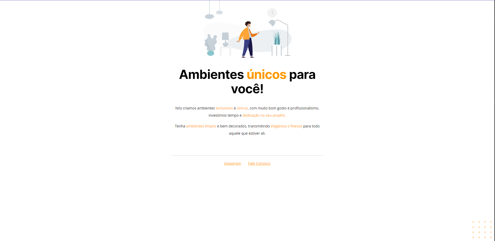
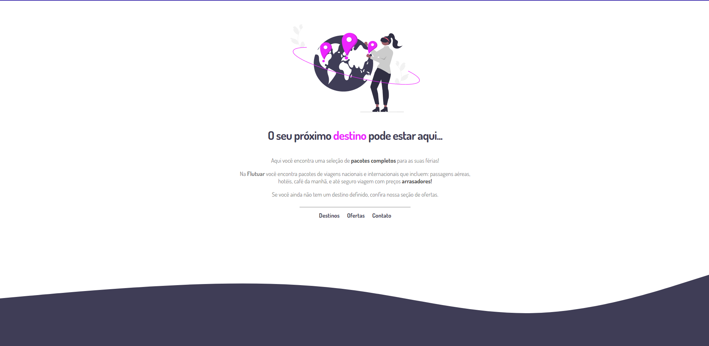
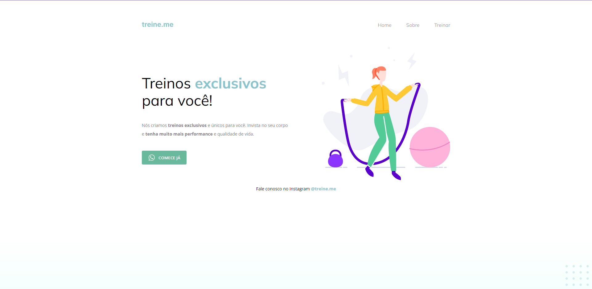
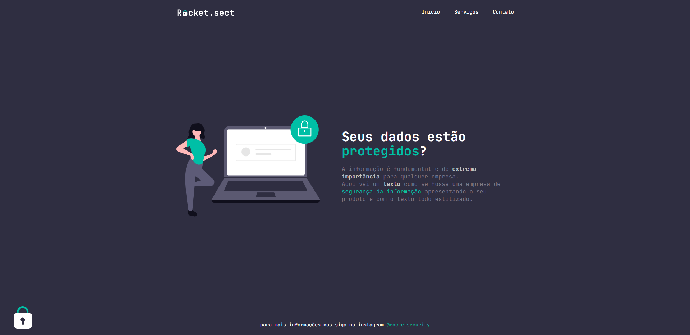

# 💜 Curso Explorer RocketSeat
Aqui neste repositório eu vou inserir os projetos principais e paralelos desenvolvidos durante a relização do curso Explorer da RocketSeat.

## 💡 Tecnologias
- HTML5
- CSS
- Javascript
- Tailwind CSS
- React
- NodeJs
- Git e Github

## 👩‍💻 Projetos
Segue, em ordem crescente, os projetos realizados:

### 🪑 Landing Page Móveis

### 🌲 Landing Page Viagem

### 🏋️‍♀️ Landing Page Treine-Me

### 🔒 Landing Page Rocket Security

