# 💜 Curso Explorer RocketSeat
Aqui neste repositório eu vou inserir os projetos principais e paralelos desenvolvidos durante a relização do curso Explorer da RocketSeat.

## 💡 Tecnologias
- HTML5
- CSS
- Javascript
- Tailwind CSS
- React
- NodeJs
- Git e Github

## 👩‍💻 Projetos
Segue, em ordem crescente, os projetos realizados:

### 🪑 Landing Page Móveis

### 🌲 Landing Page Viagem

### 🏋️‍♀️ Landing Page Treine-Me

### 🔒 Landing Page Rocket Security

### 📄 Projeto Criação de Eventos
<a href="https://gustavogarciac.github.io/explorer/projeto-05/" target="_blank" align="center">
  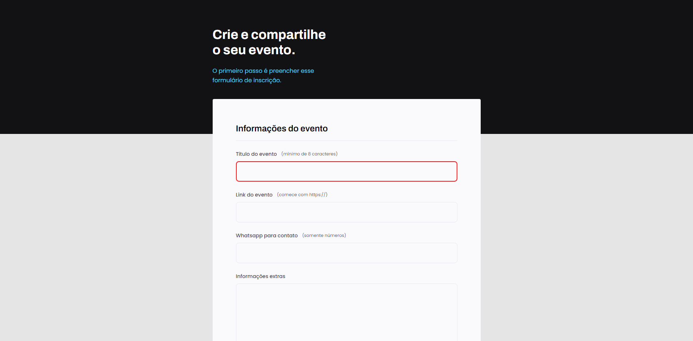
</a>

### 📄 Projeto Formulário Mentoria
<a href="https://gustavogarciac.github.io/explorer/projeto-05/advanced-form/" target="_blank" align="center">
  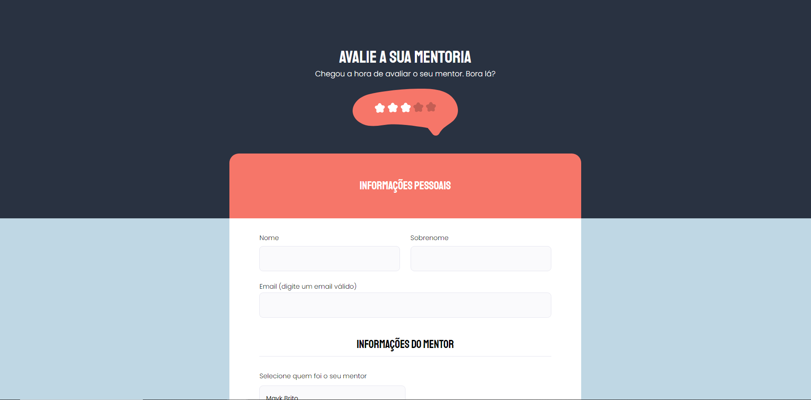
</a>

### 📄 Projeto Formulário Mentoria Simplificado
<a href="https://gustavogarciac.github.io/explorer/projeto-05/basic-form/" target="_blank" align="center">
  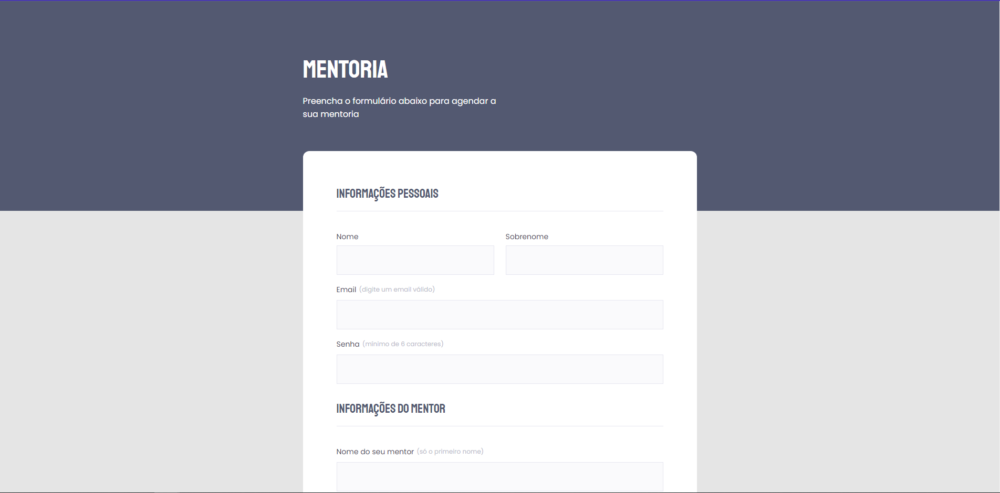
</a>

### 🎈 Image Gallery
<a href="https://gustavogarciac.github.io/explorer/projeto-06/" target="_blank" align="center">
  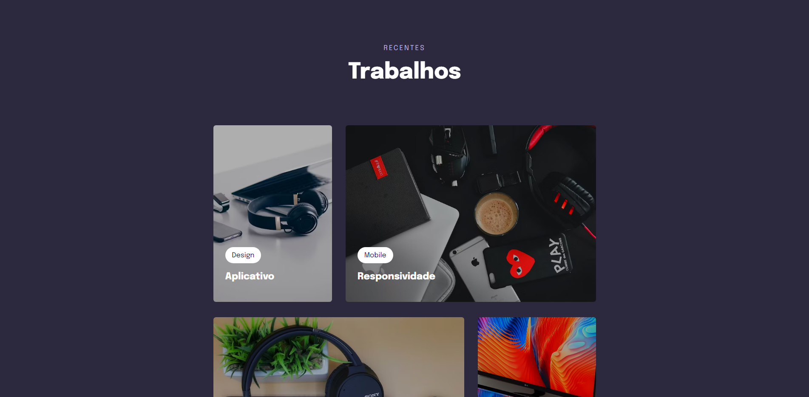
</a>

### 🍨 Space Cream
<a href="https://gustavogarciac.github.io/explorer/projeto-07/" target="_blank" align="center">
  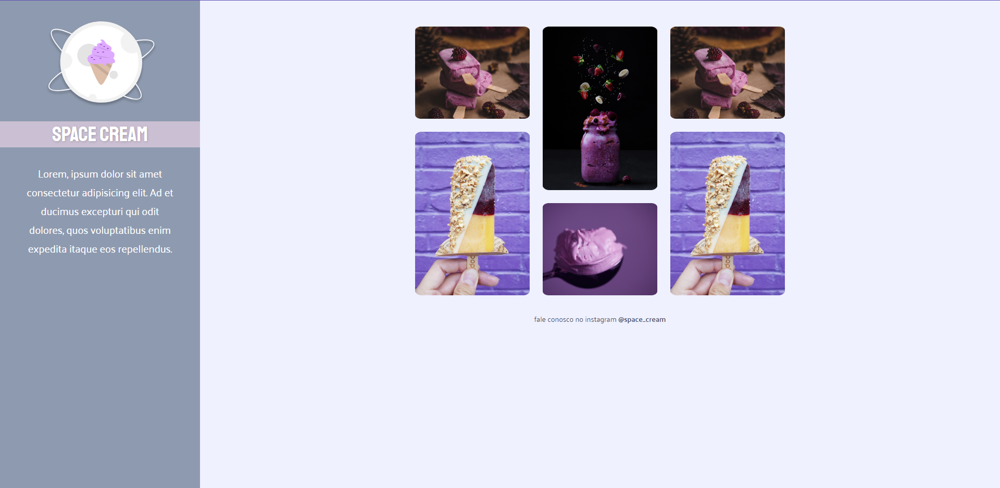
</a>

### 🔨 Whack a Mole
<a href="https://gustavogarciac.github.io/explorer/projeto-08/" target="_blank" align="center">
  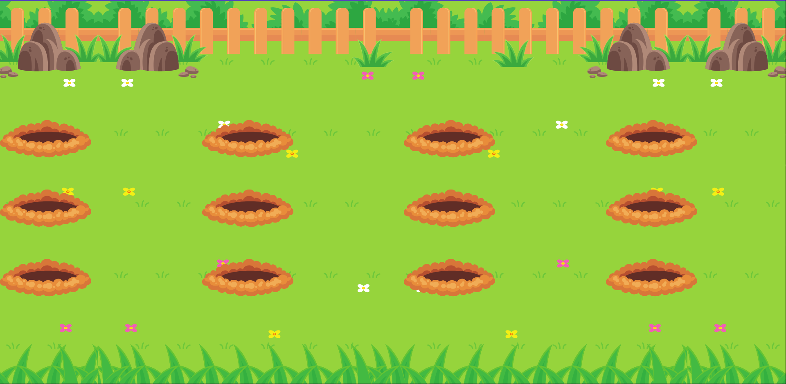
</a>

## 🐱‍👤 Projetos Extras

### 🎶 Player Música
<a href="https://gustavogarciac.github.io/explorer/extra-projects/player-musica/" target="_blank" align="center">
  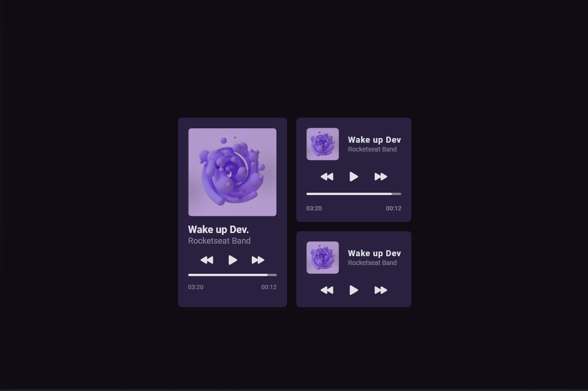
</a>

### 🪑 Card Produto
<a href="https://gustavogarciac.github.io/explorer/extra-projects/card-produto/" target="_blank" align="center">
  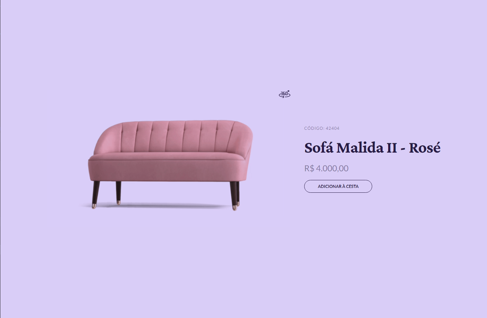
</a>

### 🚀 Landing Page Intensivão

### ✨ MultiStep Form
<a href="https://gustavogarciac.github.io/explorer/extra-projects/multistep/" target="_blank" align="center">
  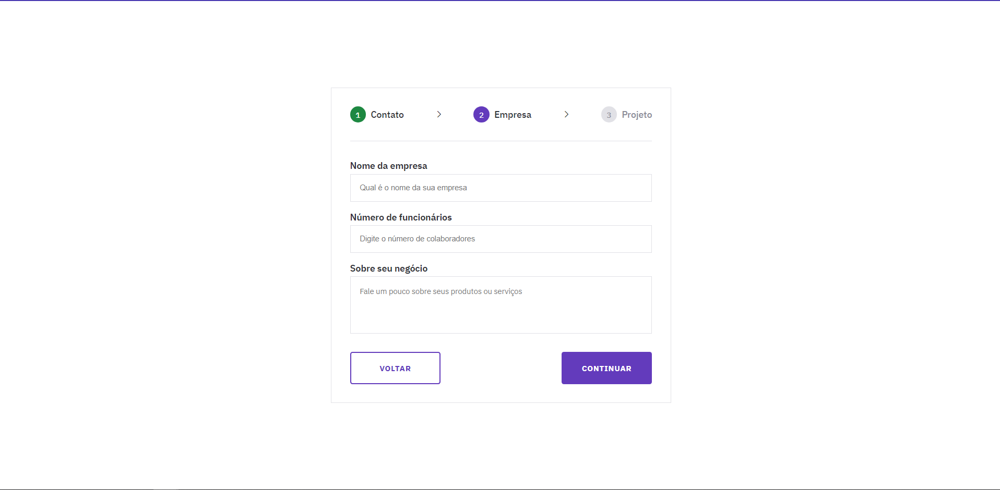
</a>

### 🎨 Color Range
<a href="https://gustavogarciac.github.io/explorer/extra-projects/ajustes-iluminacao/" target="_blank" align="center">
  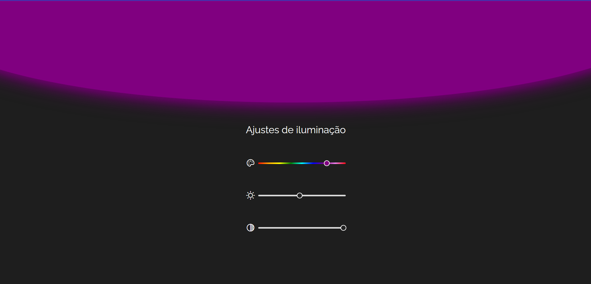
</a>

### ❤ Cálculo IMC
<a href="https://gustavogarciac.github.io/explorer/extra-projects/imc/src" target="_blank" align="center">
  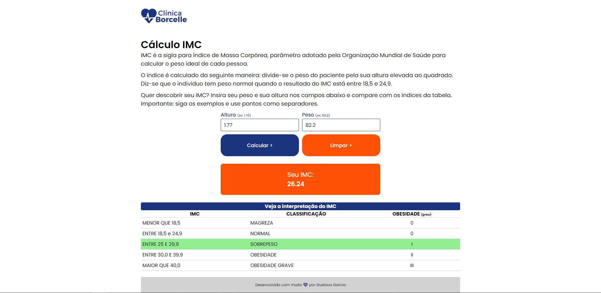
</a>
